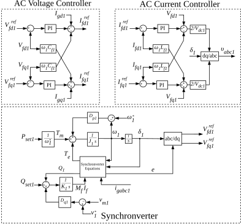

### Control Design of HVDC Link with Virtual Synchronous Generator and Implementation on Real-Time Simulator

<!-- 
This is the first line. 
And this is the second line.
 -->

<!-- 

    This is a test
    

        Matlab/simulink
        typhoon hil
        python
        PHIL
    

 -->

<!-- 

    
<svg viewBox="0 0 24 24" width="14" height="14" aria-hidden="true"
    style="opacity:0.8;">
    <rect x="3" y="4" width="18" height="18" rx="2"
        fill="none" stroke="currentColor" stroke-width="1.5"/>
    <path d="M16 2v4M8 2v4M3 10h18"
        fill="none" stroke="currentColor" stroke-width="1.5"/>
</svg>October 7,2025
    

        Matlab/simulink
        typhoon hil
        python
        PHIL
    

 -->

    

        
            <svg viewBox="0 0 24 24" width="14" height="14" aria-hidden="true" style="opacity:1;">
                <rect x="3" y="4" width="18" height="18" rx="2"
                      fill="none" stroke="currentColor" stroke-width="1.5"/>
                <path d="M16 2v4M8 2v4M3 10h18"
                      fill="none" stroke="currentColor" stroke-width="1.5"/>
            </svg>
            October 7, 2025
        
        

            Matlab/simulink
            typhoon hil
            python
            PHIL
        

    

    <!-- horizontal divider BELOW -->
    

    - This is a test
    
    This is a test

This is a test

